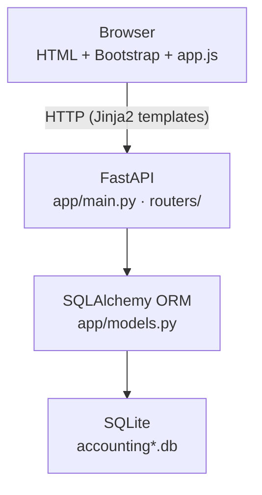
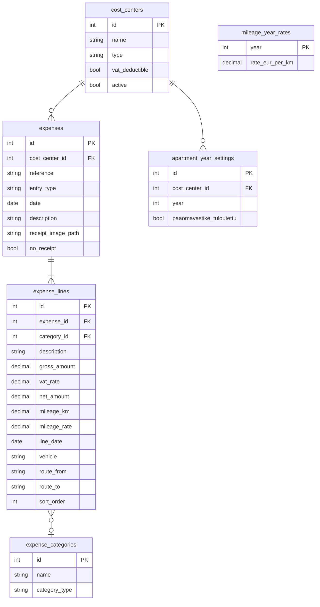
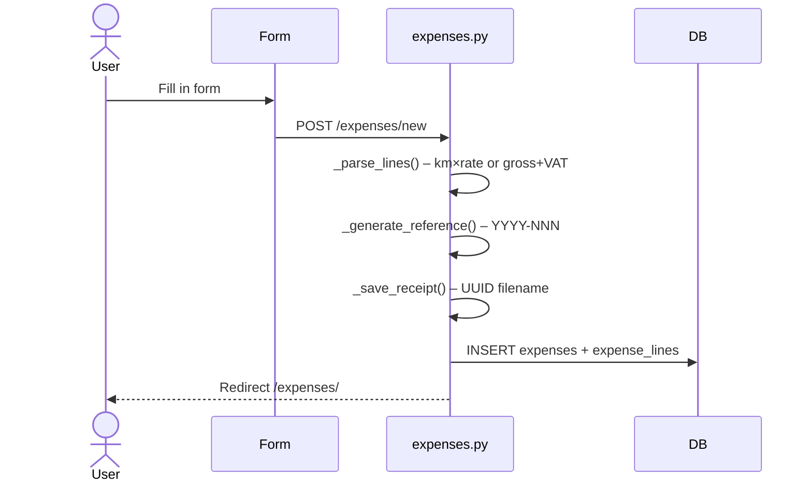
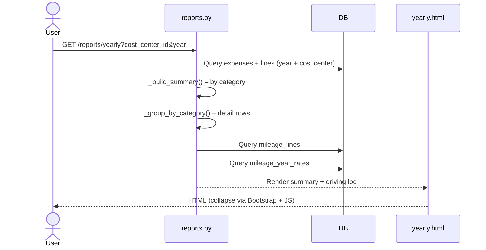
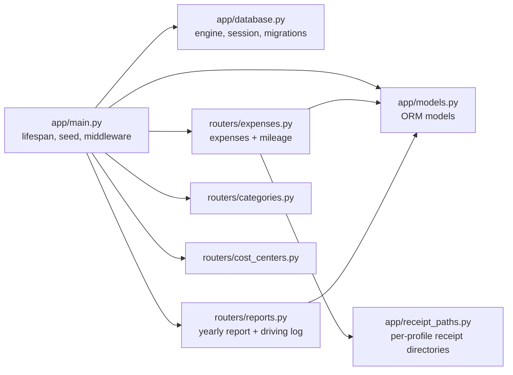
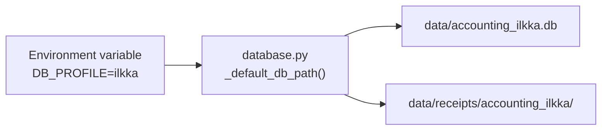

# Architecture

## Layered Structure

## Database Schema (ERD)

## Expense Save Flow

## Report Generation Flow

## Module Structure

## Multi-Database Profile Support

Start with a profile: `./start.sh --profile ilkka`
